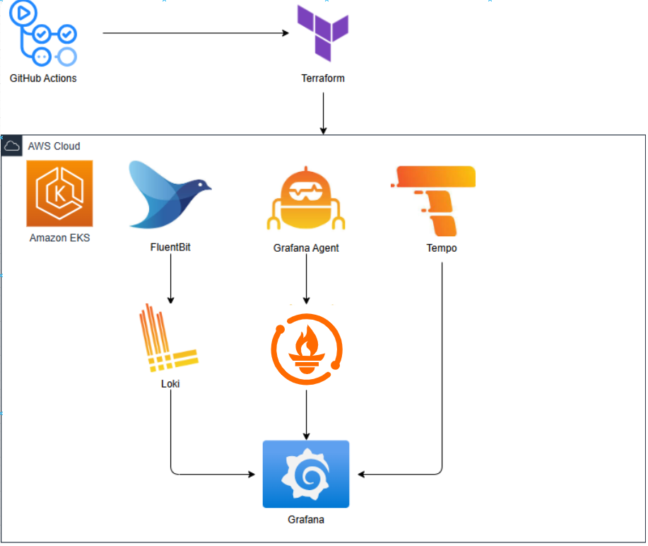

# EKS Monitoring Stack with Grafana

This project deploys a comprehensive monitoring solution on Amazon EKS using Grafana Enterprise Stack.

## Architecture

The solution includes:
- Logging Pipeline (FluentBit + Loki)
- Metrics Pipeline (Grafana Agent + Mimir)
- Traces Pipeline (Tempo)
- Visualization (Grafana)

## Prerequisites

- AWS CLI configured
- Terraform >= 1.0.0
- kubectl
- helm >= 3.0.0
- GitHub account with repository access

## Repository Structure

.
├── README.md
├── bash.sh
├── diagram_aws.png
└── project/
    ├── helm/
    │   └── values.yaml
    └── terraform/
        ├── backend.tf
        ├── eks.tf
        ├── locals.tf
        ├── main.tf
        ├── outputs.tf
        ├── variables.tf
        ├── versions.tf
        └── vpc.tf